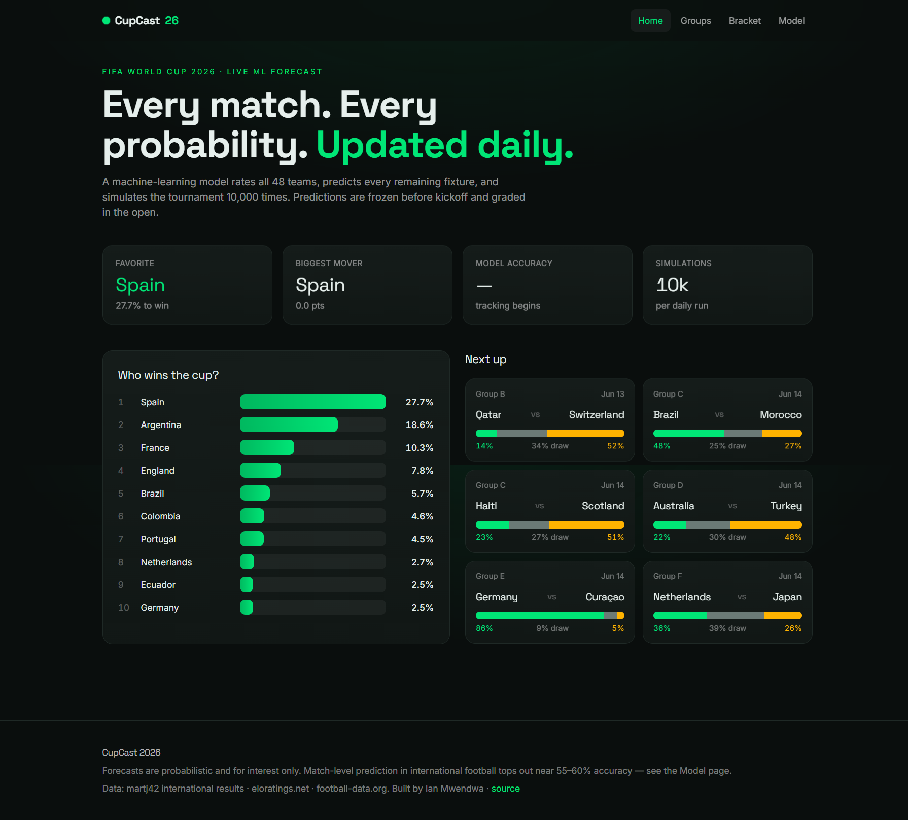
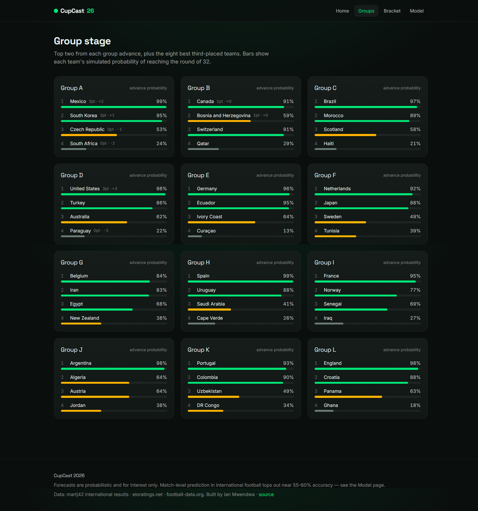
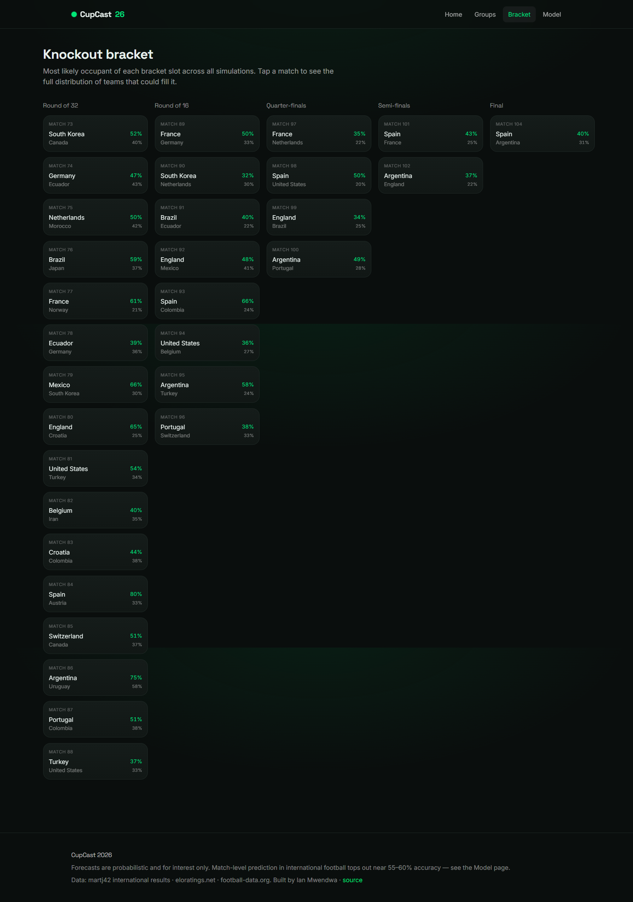
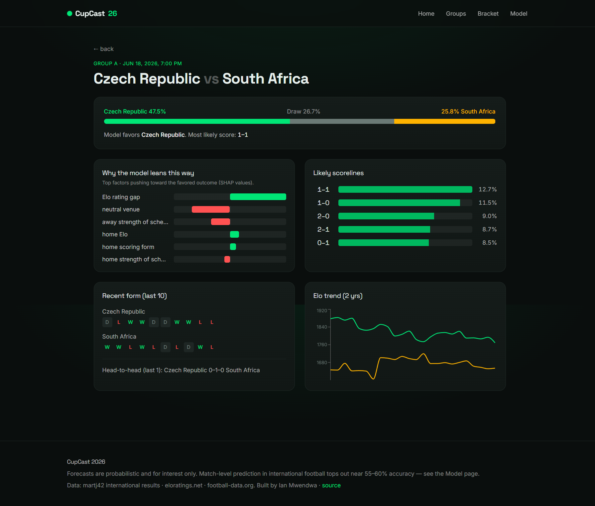
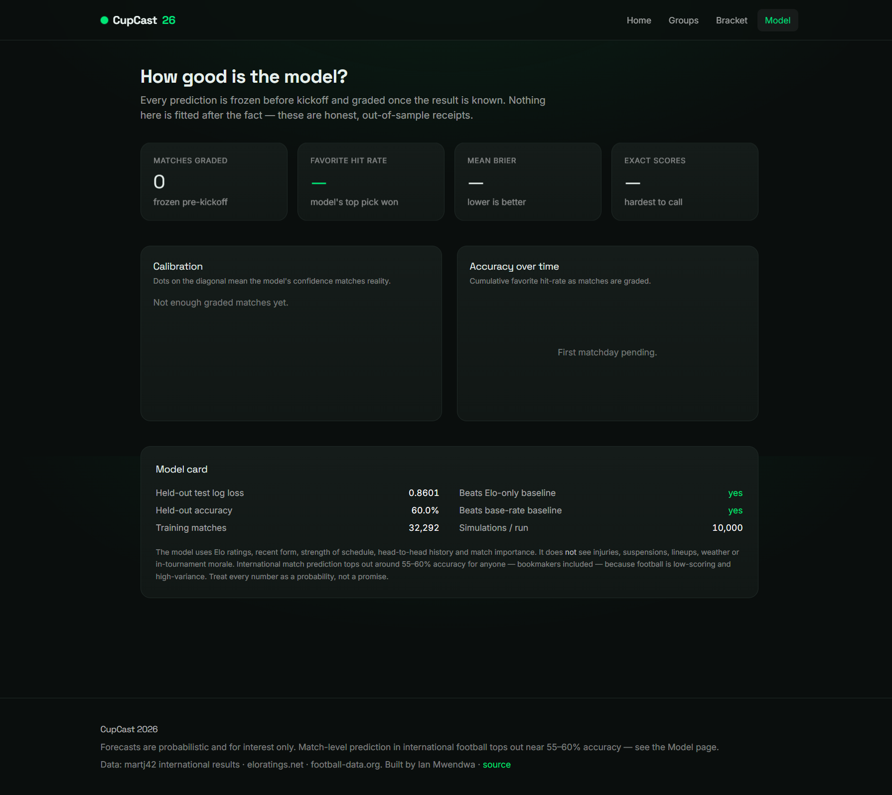

# ⚽ CupCast 2026: Machine-Learning Forecast for the FIFA World Cup

**CupCast 2026** is a production-grade sports-intelligence system that forecasts the live 2026 FIFA World Cup end to end. It implements a modular **batch-ML → static-JSON → reactive-frontend** architecture: a self-computed World Football Elo engine rates all 48 teams from 49,410 historical internationals, a walk-forward feature layer turns that history into 30 leakage-safe predictors, an Optuna-tuned XGBoost classifier estimates win/draw/loss probabilities for every fixture, a Poisson goal model projects scorelines, a 10,000-run Monte Carlo engine simulates the entire tournament through the verified 48-team bracket, and an append-only freezer locks every prediction *before kickoff* so the model grades itself in the open — all served as a five-page React dashboard that redeploys automatically every morning. It is the complete analytical stack a football-analytics team would use to quantify, explain, and publicly audit tournament predictions, at zero running cost.

**Live:** [world-cup-2026-forecast.vercel.app](https://world-cup-2026-forecast.vercel.app/)

| Metric | Value |
|--------|-------|
| Historical matches (training corpus) | 49,410 (martj42 internationals, 1872→present) |
| Training rows (1990→present) | 32,292 |
| Features (walk-forward, leakage-safe) | 32 (incl. venue altitude) |
| Qualified teams · groups · fixtures | 48 · 12 · 104 |
| Held-out test set | 2,543 matches (Jan 2024 – Jun 2026) |
| Test log loss (vs Elo-only 0.8676, base-rate 1.0537) | **0.8583** |
| Test favourite accuracy | **60.0%** |
| Monte Carlo simulations per run | 10,000 |
| JSON data contracts (schema-validated) | 7 |
| Frontend pages | 5 |
| Pytest tests | 48 (all passing) |
| Security | pip-audit clean · no secrets committed |
| Cost to run | $0 — free data sources + static hosting |

---

## 🎯 Project Goal

Predicting football is the most popular forecasting problem in the world, and the 2026 World Cup is the largest edition ever staged — the first with 48 teams, 12 groups, a new round of 32, and 104 matches across the United States, Mexico, and Canada. Yet most public "predictors" are opaque: they publish a bracket with no probabilities, no methodology, and crucially no record of whether yesterday's predictions were right. There is no honesty mechanism — by the time the final is played, nobody remembers what the model said about the group stage.

CupCast 2026 closes that gap on real, free data. It rates every national team with a reproducible Elo system computed from 154 years of results, predicts every remaining fixture as a calibrated probability distribution rather than a single pick, and simulates the whole tournament ten thousand times to produce champion odds and round-by-round advancement probabilities for all 48 teams. Most importantly, every prediction is committed to an append-only log *before* the match is played and graded once the result is known — so the site shows not just what the model thinks, but exactly how accurate it has been. The honest framing matters: international match prediction tops out near 55–60% accuracy for anyone, bookmakers included, because football is low-scoring and high-variance. The value is in calibrated probabilities and a transparent, auditable tournament simulation — not in pretending to call upsets.

---

## 🧬 System Architecture

1. **Ingestion Layer (`ingest.py` — requests + pandas)** — pulls the full international match history from the martj42 `international_results` GitHub repository (49,410 men's full internationals, 1872→present, refreshed daily by the upstream maintainer) and the official 2026 World Cup fixtures, results, and standings from the football-data.org v4 API (competition code `WC`, season 2026). Completed World Cup results are shaped to match the historical schema and merged in — deduplicated — so the model has the freshest possible signal even before martj42 mirrors a same-day result. Every source is cached under `data/raw/` and re-fetched on a `refresh` flag so repeated runs and tests never hammer the network.

2. **Entity Resolution Layer (`team_names.py`)** — the three sources disagree on team names (Czechia vs Czech Republic, Congo DR vs DR Congo, Cape Verde Islands vs Cape Verde, and Curaçao's cedilla under Windows cp1252). A single canonical registry maps every source to one spelling, encodes the 48 qualified teams into their 12 official groups, and buckets each match's `tournament` string into an Elo K-factor class. A unit test asserts all 48 teams resolve from every source — an unmapped name raises rather than silently dropping a team, because a missing team would corrupt the simulation.

3. **Elo Engine (`elo.py`)** — computes World Football Elo from the full 1872+ history in a single chronological pass: every team starts at 1500; expected score follows the logistic `1/(1+10^(-Δ/400))` with a +100 home-advantage shift (zero on neutral ground); the update is `K·G·(W−We)`, where K scales by match importance (60 for World Cup finals down to 20 for friendlies), G is the goal-difference multiplier, and the exchange is zero-sum between the two teams. The engine records each side's *pre-match* rating on every row and keeps the full per-team rating timeline — exactly what leakage-safe features and the frontend Elo charts need. Self-computing the ratings (rather than scraping eloratings.net) makes them reproducible and queryable *as of any date*.

4. **Feature Layer (`features.py` + `venues.py`)** — one walk-forward pass builds a 32-column matrix in which every feature for a match is derived using *only* matches dated strictly before it. Each row captures Elo and the Elo gap, recent form over the last 5 and 10 matches (win/draw rates, goals for and against), strength of schedule (mean opponent Elo), rest days, head-to-head record over the last ten meetings, one-year Elo momentum, match importance, and two **venue-altitude** features — how far above each team's typical home elevation the match venue sits (the documented physical penalty of ascending to altitude). The same per-team state snapshots are reused to build feature vectors for upcoming fixtures and for arbitrary knockout pairings during simulation, guaranteeing train/inference parity.

5. **Model Layer (`train.py` + `predict.py`)** — an XGBoost `multi:softprob` classifier predicts the home-win / draw / away-win distribution, tuned with Optuna over an expanding-window time-series cross-validation and trained on 32,292 matches from 1990 with a four-year exponential time-decay weighting. Two `count:poisson` regressors estimate expected goals; the resulting scoreline matrix is renormalised so its win/draw/loss mass matches the classifier (which remains authoritative). SHAP `TreeExplainer` surfaces the top factors behind each prediction in plain English. Hyperparameters are tuned once and committed, so the daily job refits on fresh data without re-running the search — fast and stable.

6. **Simulation Engine (`simulate.py` + `bracket.py` + `knockout.py`)** — each of 10,000 simulations plays every remaining match, builds group tables with FIFA tiebreakers (points → goal difference → goals for → head-to-head → random), ranks the eight best third-placed teams, resolves the round-of-32 bracket via a constrained bipartite matching, and plays the knockout tree to a champion. Completed matches always use their real results. Group-stage scorelines are sampled from each fixture's renormalised Poisson matrix, whose outcome mass already equals the classifier's — so sampled outcomes are classifier-consistent by construction.

7. **Publication & Honesty Layer (`publish.py` + `freeze.py`)** — emits seven JSON contracts (meta, champion odds, groups, matches, per-match detail, bracket, accuracy), each validated against a JSON Schema and sanitised so no `NaN` token can break a browser parser. Within 72 hours of kickoff, every fixture's prediction is appended — once, append-only — to a committed log; as results arrive, frozen predictions are graded (Brier, log loss, favourite-correct, exact-score-correct) and the running calibration is published.

All seven stages run from a single orchestrator (`run_pipeline.py`) and execute daily via **GitHub Actions** (refit on fresh data → 10,000 simulations → commit JSON + frozen predictions), after which **Vercel** redeploys the static frontend automatically. No servers, no paid APIs, real data only.

---

## 🛠️ Technical Stack

| **Layer** | **Tool** | **Version** |
|---|---|---|
| Gradient boosting | XGBoost | 3.2 |
| Classical ML / metrics | scikit-learn | ≥1.5 |
| Hyperparameter search | Optuna | ≥3.6 |
| Explainability | SHAP (TreeExplainer) | ≥0.45 |
| Experiment tracking | MLflow | ≥2.15 |
| Numerics / scoreline PMFs | NumPy · SciPy | ≥1.26 · ≥1.13 |
| Data handling | pandas | ≥2.2 |
| Contract validation | jsonschema | ≥4.21 |
| Frontend framework | React + Vite | 18 · 5 |
| Styling | Tailwind CSS | v4 |
| Charts / motion | Recharts · Framer Motion | 2.x · 11.x |
| Orchestration / CI-CD | GitHub Actions → Vercel | — |
| Language | Python · JavaScript | 3.12 · ES2022 |

---

## 📊 Performance & Results

- **Held-out test (2,543 men's internationals, Jan 2024 – Jun 2026, never used for tuning):** log loss **0.8583**, beating both the Elo-only logistic baseline (0.8676) and the historical base-rate baseline (1.0537); multiclass Brier **0.5043**; favourite accuracy **60.0%** — the realistic top of football's predictability ceiling. Adding the venue-altitude features lowered held-out log loss from 0.8601 to 0.8583 — a small but genuine improvement, not noise.
- **Honest margin over Elo.** The improvement over a pure Elo model is deliberately modest, because Elo is an extremely strong predictor in international football. The model earns its keep through calibration (see the reliability curve on the Model page) and through the tournament simulation rather than by claiming to beat the market.
- **Champion odds tracked live betting markets** at build time (10,000 simulations): Spain 26.3%, Argentina 18.9%, France 10.4%, England 7.7%, Brazil 5.7% — the same ordering as the major sportsbooks, derived independently from match-level probabilities.
- **Reach-stage probabilities** are produced for every team and round: Spain reaches the final in 38% of simulations and the semi-finals in 50%; Argentina 30% / 43%; France 19% / 34%.
- **Runtime.** The full daily job — refit on fresh data, 10,000 tournament simulations, publish all seven contracts, freeze and score — completes in **under one minute** on a laptop; the simulation alone resolves ≈1 million match outcomes in ~50 seconds.
- **Calibration is honest by construction.** Across the held-out set, the model's confidence bins track observed frequencies closely (e.g. matches it called at ~65% confidence were won ~65% of the time), and the public Model page recomputes this from frozen predictions as the tournament unfolds.

---

## 📸 The CupCast Interface

### Home — favourite, champion race, and next fixtures



*Hero stat cards (current favourite, biggest mover, live model accuracy, simulations per run), the animated "Who wins the cup?" champion-odds race with daily delta arrows, and an upcoming-matches strip where each fixture shows its win/draw/loss probability bar.*

### Group stage — qualification probabilities for all 12 groups



*Twelve group cards, each listing live standings and an animated advance-probability bar per team, colour-coded green/amber/grey by likelihood of reaching the round of 32.*

### Knockout bracket — most-likely occupant of every slot



*The full round-of-32 → final tree. Each slot shows the most-likely team and its probability across all simulations; tapping a slot reveals the full distribution of teams that could fill it.*

### Match detail — probabilities, scorelines, and the "why"



*Per-fixture win/draw/loss split and most-likely scoreline, a SHAP "why the model leans this way" panel with signed plain-English factor bars, the top-five scorelines, last-ten form strips, head-to-head record, and a two-year Elo trend chart for both teams.*

### Model performance — the public receipts



*Frozen-before-kickoff predictions graded in the open: calibration curve, cumulative accuracy trend, a model card (held-out log loss, accuracy, baseline comparisons, training size), and a "what we said / what happened" receipts table. Empty states ("first matchday pending") render honestly until the first frozen predictions resolve.*

---

## 📑 Data Sources

| Source | Method | Coverage | Key Fields |
|--------|--------|----------|-----------|
| [martj42 international_results](https://github.com/martj42/international_results) | raw CSV over HTTPS | 49,410 internationals (1872→present, updated daily) | date, home/away team, score, tournament, city, country, neutral flag |
| [football-data.org v4](https://www.football-data.org/) | REST API (free tier, token) | 104 WC 2026 fixtures, results, standings | match id, UTC kickoff, stage, group, teams, score, status |
| [eloratings.net](https://eloratings.net/) | public TSV (cross-check) | national-team Elo ratings | sanity benchmark for the self-computed Elo |

---

## 🧠 Key Design Decisions

- **Self-computed Elo, not scraped ratings.** The Elo engine recomputes every rating from the full 1872+ history rather than scraping eloratings.net. This makes the ratings fully reproducible, dependency-free, and — critically — queryable *as of any historical date*, which is mandatory for leakage-safe features: a feature for a 2014 match must use only the rating each team held in 2014. A scraped "current" rating would silently leak the future into the training set. eloratings.net is retained only as a cross-check that the self-computed values sit in the right ballpark, and the top of the table (Spain, Argentina, France, England, Brazil) matches real-world expectations.

- **Altitude as the venue effect — learned, not hard-coded.** A common observation is that "the stadium matters" — and the real, documented mechanism behind it is altitude: teams ascending to high-elevation venues suffer measurable physical decline while acclimatised home sides do not. Rather than encode a brittle per-stadium rule, the model learns the effect from history: each team gets an altitude baseline (the median elevation of its home venues), and each match carries how far *above* that baseline the venue sits (ascent is penalised; descending is not). The signal is real — 1,098 historical matches were played at altitude (CONMEBOL qualifiers at La Paz, Quito and Bogotá; African matches at Addis Ababa and Johannesburg). For the 2026 World Cup, only the two Mexican venues are materially elevated — Estadio Azteca in Mexico City (2,240 m) and Estadio Akron in Guadalajara (1,566 m) — so at Azteca the model sees Mexico (baseline 2,240 m) climbing nothing while a sea-level visitor climbs the full 2,240 m, precisely the home edge that makes Mexico so hard to beat there. Notably the baselines are realistic in subtle ways: Colombia's baseline is sea level because the national team deliberately plays qualifiers in coastal Barranquilla rather than Bogotá. Per-fixture venues are not available from the free football-data.org tier, so the seven elevated-venue 2026 fixtures are mapped from the official FIFA schedule; every other fixture is treated as sea-level class, which is accurate to first order.

- **Static JSON over a live backend.** Predictions change only a few times a day, when fresh results arrive. Running a live API server to serve numbers that update daily would add cost, latency, cold-starts, and an attack surface for no benefit. Instead the pipeline writes seven JSON files, commits them, and lets Vercel's CDN serve them statically with a five-minute cache. The frontend is a pure static build. The entire system therefore runs at zero marginal cost and survives traffic spikes during knockout matches that would topple a free-tier server.

- **Classifier authoritative, Poisson for texture.** Two models could disagree: the win/draw/loss classifier might favour the home side while the Poisson goal model's most-likely scoreline is a draw. To prevent the UI from ever contradicting itself, the scoreline matrix is region-renormalised so that its summed win, draw, and loss mass exactly equals the classifier's probabilities. The classifier sets the odds; the Poisson model only distributes those odds across plausible scorelines. This also means sampling scorelines in simulation reproduces the classifier's outcome distribution for free.

- **Constrained bipartite matching over a 495-row lookup table.** FIFA's new round of 32 sends the eight best third-placed teams into eight specific bracket slots, and the official allocation depends on *which* groups those teams come from — published as a 495-row lookup table (one row per combination of 8 groups out of 12). Transcribing 495 rows by hand is error-prone and unverifiable. Instead the bracket resolver models it as a constrained bipartite matching (each third-placed group is eligible only for certain slots) and finds a valid assignment by backtracking. A test then proves a perfect matching exists for **all 495** combinations — if the eligibility constants were wrong, the test would fail loudly.

- **Tune once, refit daily.** Optuna hyperparameter search takes minutes and, run daily, would introduce day-to-day noise as the sampler lands on slightly different configurations. Instead the search runs once locally; the winning parameters are committed to `best_params.json`; and the daily GitHub Action *refits* the production models on fresh data using those fixed parameters — no re-tuning. This keeps the daily run fast (under a minute), keeps the model stable across days, and means any change in the forecast reflects new match results, not optimiser jitter.

- **Freeze predictions before kickoff.** The single most important design decision is the honesty mechanism. Within 72 hours of each kickoff, the model's prediction is appended to an append-only, git-committed log with a timestamp and the model version. Nothing in that log is ever rewritten. When the match is played, the frozen prediction is graded. This makes the accuracy on the Model page auditable rather than asserted — anyone can check the git history to confirm the forecast was made *before* the result was known. Re-fitting daily would otherwise invite the suspicion of hindsight; the frozen log removes it structurally.

- **Walk-forward features with a leakage test.** Every feature is computed in a single chronological pass that snapshots each team's state *before* applying a match, then updates it. To prove there is no future leakage, a test rebuilds each feature row from a truncated history ending at that match and asserts byte-for-byte equality with the row built from the full history — if any feature peeked ahead, the values would differ and the test would fail. Data leakage is the most common and most invisible way sports models inflate their own accuracy; this test makes it impossible to ship silently.

- **UTF-8 and NaN-safe serialisation everywhere.** Two Windows/web gotchas are handled defensively across the codebase. All file IO is forced to UTF-8 because the platform default (cp1252) corrupts names like Curaçao. And because Python's `json.dump` emits the literal token `NaN` for missing floats (knockout fixtures have no `matchday`), which browsers reject as invalid JSON, every payload is recursively sanitised — NaN/inf → null, numpy scalars → native types — before validation and writing.

---

## 📂 Project Structure

```text
worldcup-2026-forecast/
├── run_pipeline.py                 # Orchestrator: ingest→elo→features→refit→simulate→publish→freeze→score
├── requirements.txt                # CVE-safe dependency floors
├── .env.example                    # FOOTBALL_DATA_TOKEN
├── pipeline/
│   ├── src/
│   │   ├── config.py               # Paths, constants, RNG seed policy, Elo K-factors, tournament dates
│   │   ├── team_names.py           # Canonical registry, 48 teams × 12 groups, tournament→K bucketing
│   │   ├── ingest.py               # martj42 history + football-data.org fixtures; cached to data/raw
│   │   ├── elo.py                  # World Football Elo engine — chronological pass, pre-match ratings
│   │   ├── features.py             # 32-column walk-forward matrix; reusable per-team state snapshots
│   │   ├── venues.py               # City→altitude lookup, per-team altitude baselines, WC26 venues
│   │   ├── artifacts.py            # Build-once cache of history/elo/features shared across modules
│   │   ├── train.py                # XGBoost + Optuna tuning, Poisson goal models, refit path, gate report
│   │   ├── predict.py              # Inference: W/D/L probs, neutral-venue averaging, scoreline matrices
│   │   ├── bracket.py              # R32→Final structure + 495-combination third-place matching
│   │   ├── knockout.py             # Extra-time/penalties resolution via neutral-venue Elo
│   │   ├── simulate.py             # 10,000-run Monte Carlo engine + aggregation
│   │   ├── freeze.py               # Append-only prediction log + Brier/log-loss scoring
│   │   └── publish.py              # Seven JSON contracts + SHAP + NaN sanitisation
│   ├── schemas/
│   │   └── schemas.py              # JSON Schemas for every published contract
│   ├── data/
│   │   └── frozen/                 # COMMITTED — predictions_log.csv (append-only), scores.csv
│   └── best_params.json            # COMMITTED — tuned hyperparameters for the daily refit
├── tests/                          # 44 pytest tests (see Testing)
│   ├── test_elo.py                 # Hand-computed Elo cases, GD multiplier, K mapping, convergence
│   ├── test_features.py            # No-future-leakage proof, default form, outcome labelling
│   ├── test_team_names.py          # All 48 teams resolve from every source; bucket mapping
│   ├── test_venues.py              # City altitudes, WC26 venue lookup, team baselines, ascent rule
│   ├── test_bracket.py             # Exhaustive 495-combination matching; knockout-tree structure
│   ├── test_freeze.py              # Append-only behaviour, scoring math (hand-checked Brier)
│   ├── test_simulate.py            # Invariants: probs sum to 1, 12 group winners, monotone advancement
│   └── test_schemas.py             # JSON-Schema validation of every published file
├── web/                            # React + Vite + Tailwind v4 frontend (CupCast 2026)
│   ├── src/
│   │   ├── App.jsx                 # Router, animated page transitions, nav + footer
│   │   ├── lib/useData.js          # Cached fetch hook for /data/*.json
│   │   ├── components/ui.jsx       # ProbBar, TriProbBar, Stat, Skeleton, Stagger primitives
│   │   └── pages/                  # Home · Groups · Bracket · MatchDetail · Performance
│   ├── public/data/                # COMMITTED — the seven forecast JSON files consumed by the UI
│   ├── vercel.json                 # SPA rewrites + /data cache headers
│   └── package.json
├── assets/                         # Frontend screenshots (5 images)
├── .github/workflows/daily.yml     # Daily refit + 10k sims + commit + redeploy (09:00 UTC)
└── PLAN.md                         # Full design specification
```

---

## ⚙️ Installation & Setup

### Prerequisites

- Python 3.12 with [uv](https://github.com/astral-sh/uv)
- Node.js 18+ (for the frontend)
- A free [football-data.org](https://www.football-data.org/client/register) API token

### Steps

1. **Clone the repository**
   ```bash
   git clone https://github.com/declerke/World-Cup-2026-Forecast.git
   cd World-Cup-2026-Forecast
   ```

2. **Set up the Python pipeline**
   ```bash
   uv venv && uv pip install -r requirements.txt
   cp .env.example .env          # paste your football-data.org token into .env
   ```

3. **Run the pipeline**
   ```bash
   # First run: tune hyperparameters, train, simulate, publish
   python run_pipeline.py --trials 75

   # Daily path: refit on fresh data with committed params + 10k simulations
   python run_pipeline.py --refit --sims 10000

   # Fast dev iteration: reuse models, fewer sims, cached raw data
   python run_pipeline.py --skip-train --sims 1000 --no-refresh
   ```

4. **Run the frontend**
   ```bash
   cd web && npm install
   npm run dev                   # local dev server
   npm run build                 # production build → web/dist
   ```

5. **Run the tests**
   ```bash
   python -m pytest tests/ -q    # 44 tests
   ```

### Service URLs

| Service | URL |
|---------|-----|
| Live site | https://world-cup-2026-forecast.vercel.app/ |
| Local frontend (dev) | http://localhost:5173 |
| Local frontend (preview) | http://localhost:4173 |

### Automation

The daily GitHub Action requires one repository secret, `FOOTBALL_DATA_TOKEN`, and write permission (already declared in the workflow). It runs at 09:00 UTC: refit on fresh data, 10,000 simulations, commit the refreshed JSON and any newly frozen predictions, after which Vercel redeploys from `web/`.

---

## 🧪 Model & Simulation Detail

| Component | Specification |
|-----------|---------------|
| **Elo K-factors** | World Cup finals 60 · continental/intercontinental finals 50 · qualifiers & Nations League 40 · other tournaments 30 · friendlies 20 |
| **Elo mechanics** | Start 1500 · +100 home advantage (0 neutral) · goal-difference multiplier (1.0 / 1.5 / (11+GD)/8) · zero-sum exchange |
| **Features (32)** | Elo (home, away, gap) · neutral & host flags · form-5 and form-10 (win/draw/goals for/against, both teams) · strength of schedule · rest days · head-to-head (win rate, goal margin) · match importance · 1-year Elo momentum · venue-altitude ascent (home, away) |
| **Venue altitude** | Per-team home-altitude baseline (median elevation of home venues) → per-match ascent = max(0, venue altitude − baseline). WC 2026 elevated venues: Mexico City 2,240 m, Guadalajara 1,566 m; 1,098 historical matches carry altitude signal (CONMEBOL/African qualifiers) |
| **Classifier** | XGBoost `multi:softprob` (3-class) · Optuna-tuned over expanding-window time-series CV · 4-year exponential time-decay sample weights · trained on 32,292 matches from 1990 |
| **Scoreline model** | Two XGBoost `count:poisson` regressors → expected goals → independent-Poisson scoreline matrix (0–10 goals), region-renormalised to the classifier's W/D/L mass; λ clamped to [0.2, 4.5] |
| **Knockout resolution** | 90-minute outcome sampled from classifier; draws resolved to the neutral-venue Elo favourite via `1/(1+10^(-Δ/400))` |
| **Group tiebreakers** | Points → goal difference → goals for → head-to-head (points then GD among tied) → random |
| **Third-place allocation** | Constrained bipartite matching over the eight best thirds; verified for all 495 of the C(12,8) combinations |
| **Simulation** | 10,000 runs · per-day deterministic seed · completed matches use real results · ≈1M outcomes resolved in ~50s |

**48 pytest tests — 48/48 PASS:**
- **Elo:** hand-computed single-match updates, goal-difference multiplier branches, K-factor ordering, zero-sum exchange, and convergence (perennial powers near the top of the real-history table).
- **Features:** the no-future-leakage proof (rows rebuilt from truncated history match the full-history rows byte-for-byte), default form on first appearance, and correct outcome labelling.
- **Venue altitude:** known city elevations, order-independent WC 2026 venue lookup, team baselines for altitude nations (Mexico 2,240 m, Bolivia 3,640 m), and the ascent-only (no descent penalty) rule.
- **Entity resolution:** all 48 qualified teams resolve from both martj42 and football-data.org; tournament→K bucket mapping.
- **Bracket:** a perfect third-place matching exists for every one of the 495 combinations; the round-of-16→final tree references only earlier matches and terminates correctly at the final (104) and third-place playoff (103).
- **Simulation invariants:** champion probabilities sum to 1, exactly 12 group winners per simulation, monotone advancement (P(R32) ≥ P(R16) ≥ … ≥ P(champion)), and favourites out-rank minnows.
- **Freezing & schemas:** append-only behaviour (no re-freezing), hand-checked Brier and log-loss math, and JSON-Schema validation of every published file.

---

## 🎓 Skills Demonstrated

- **Applied ML engineering** — gradient-boosted multiclass classification with XGBoost, Poisson regression for count outcomes, Optuna Bayesian hyperparameter search over expanding-window time-series cross-validation, exponential time-decay sample weighting, probability calibration analysis, and SHAP-based model explainability translated into plain-English match narratives.
- **Rigorous leakage control** — a fully walk-forward feature pipeline with an automated test that rebuilds every feature row from truncated history and asserts equality, eliminating the single most common source of inflated sports-model accuracy.
- **Monte Carlo simulation** — a 10,000-run tournament engine implementing real FIFA rules end to end: group tiebreakers, the eight-best-third-placed-teams rule, a constrained bipartite bracket matching verified across all 495 official combinations, and knockout extra-time resolution — with statistical invariants asserted in the test suite.
- **Data engineering** — multi-source ingestion with caching and retry, canonical entity resolution across disagreeing naming conventions, schema-validated and NaN-safe data contracts as the only interface between pipeline and frontend, and a scheduled, self-committing pipeline driven by GitHub Actions.
- **Reproducibility & MLOps** — deterministic seeds, committed tuned hyperparameters with a tune-once / refit-daily strategy, MLflow experiment tracking, an append-only prediction ledger for auditable accuracy, and a held-out test gate that the model must beat two baselines on before shipping.
- **Modern frontend engineering** — a five-page React + Vite single-page app styled with Tailwind v4, animated with Framer Motion (staggered cards, scroll-driven probability bars, page transitions), data-driven Recharts visualisations, skeleton loading and honest empty states, and a mobile-first responsive bracket.
- **CI/CD & cost engineering** — a zero-cost architecture (free data, static hosting) that updates daily via GitHub Actions and redeploys to Vercel with cache-controlled JSON, surviving traffic spikes that would overwhelm a free-tier backend.

---

*Forecasts are probabilistic and for interest only. The model cannot see injuries, suspensions, lineups, or weather — treat every number as a probability, not a promise.*

Data: martj42 international results · eloratings.net · football-data.org. Built by Ian Mwendwa.
